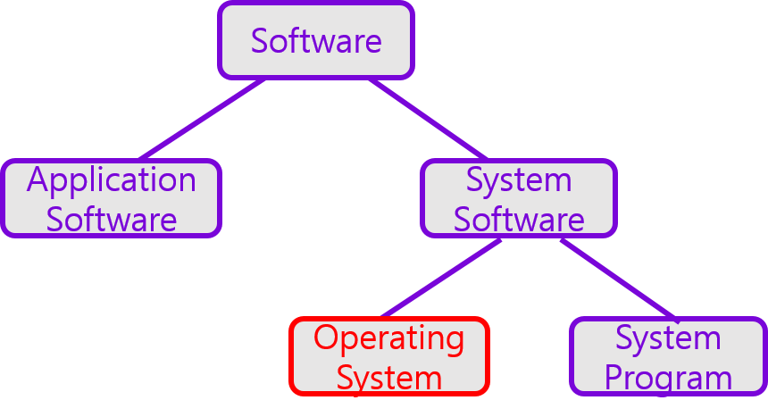
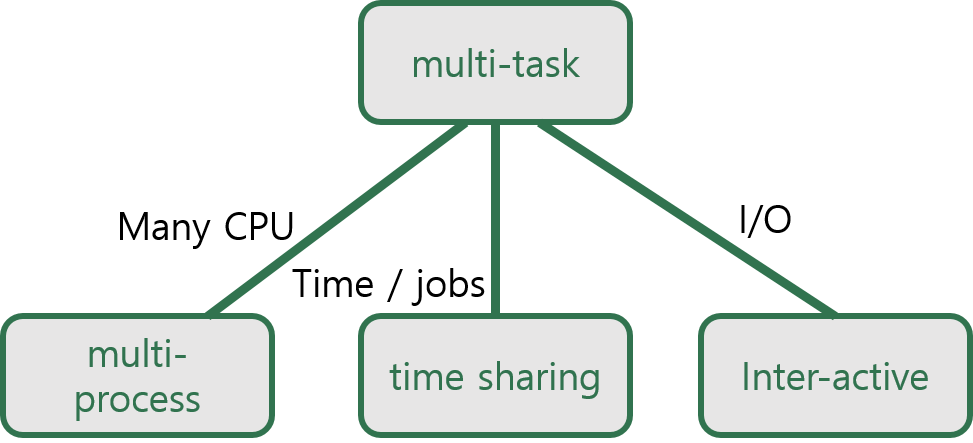

소프트웨어는 크게 응용 소프트웨어와 시스템 소프트웨어로 나뉜다. 응용 소프트웨어는 ms word나 게임과 같은 각종 응용 프로그램들의 집단이다. 시스템 소프트웨어는 다시 운영체제와 시스템 르로그램으로 나뉜다. 운영 체제는 사용자에게 인터페이스를 제공하면서 컴퓨터의 자원을 관리하는 소프트웨어이다. 시스템 프로그램은 hw 시스템을 구동하기 위한 프로그램들이다.

#### 1세대 운영체제 : 일괄저리 시스템(Single-stream Batch Processing System)
Batch란 한번 작업이 시작하면 해당 작업이 끝날 때까지 다른 작업들은 기다려야 하는 방식으로, 작업들은 차례대로, 중간에 다른 개입없이 처리된다. 언제까지나 일이 다 끝나길 기다릴 수는 없기 떄문에 그나마 일을 빨리 처리하기 위해서 여러 작업을 미리 올려두고 작업(일의 단위)들을 처리를 했다.

#### 2세대 운영체제 : 폰 노이만의 Stored Program Concept와 여러 작업을 처리하는 방법들
트랜지스터가 진공관을 대체할 수 있게 되면서 주기억 장치가 사용되고, 폰 노이만에 의해 주지억 장치에 명령어를 저장하는 방식이 개발되었다. 여러 작업들을 처리한 방법들도 개발되었는데, 다중 프로그래밍 시스템(Multiprogramming System), 다중 처리 시스템 (Multiprocessing System), 시분할 시스템 (Time Sharing System), 대화식 시스템 (Interacitve System) 등이 있다고 한다.
+ 다중 프로그램밍 시스템은 여러 작업을 처리하기 위해 미리 주기억 장치에 올리는 방식을 말한다.
+ 다중 처리 시스템은 여러 CPU를 두어서 동시에 여러 작업들이 병렬로 처리가 가능한 방식을 말한다. (multi task + multi processor)
+ 시분할 시스템은 프로세서의 작업 시간을 작업의 개수로 나눠서 n만큼식 처리하는 방법이다. (multi task + time share)
+ 대화식 시스템은 마우스나 키보드같은 입출력이 많은 시스템에서 사용된다. 응답 시간을 빠르게 하기 위해서 고려해야하는 부분들이 있다. (multi task + I/O)

## 정리
+ 운영 체제 = 사용자 인터페이스 + 자원 관리
+ 시스템 프로그램 = HW 시스템을 구동하기 위한 프로그램
+ 시스템 소프트웨어 = 운영 체제 + 시스템 프로그램
+ 응용 소프트웨어 = 응용 스로그램 집단
